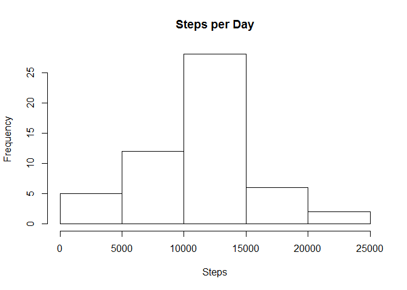

# Reproducible Research: Peer Assessment 1

## Loading and preprocessing the data


```r
library(lattice)

rawData <- read.csv("activity.csv")
cleanData <- rawData[complete.cases(rawData),]
```

## Create a historgram for the total number of steps taken per day?


```r
toatlSteps <- aggregate(steps ~ date, cleanData, sum)

hist(toatlSteps$steps, main = "Steps per Day", xlab = "Steps")
```

 

## What is mean total number of steps taken per day?


```r
mean(toatlSteps$steps)
```

```
## [1] 10766.19
```

## What is median total number of steps taken per day?


```r
median(toatlSteps$steps)
```

```
## [1] 10765
```

## What is the average daily activity pattern?


```r
intervalSteps <- aggregate(steps ~ interval, cleanData, mean)

plot(intervalSteps$interval,intervalSteps$steps, xlab = "Interval", 
        ylab = "Average Steps", type = "l")
```

 

## What is the maximum average 5 minute interval?


```r
max(intervalSteps$steps)
```

```
## [1] 206.1698
```

## How many rows have missing data?


```r
length(rawData$steps[is.na(rawData$steps)])
```

```
## [1] 2304
```

## Imputing missing values


```r
fillData <- rawData

for(i in 1:nrow(fillData)){
    if(is.na(fillData[i,"steps"])) {        
        fillData[i,"steps"] <- intervalSteps[intervalSteps$interval == fillData[i,"interval"],"steps"]
    }
}

toatlFillSteps <- aggregate(steps ~ date, fillData, sum)
```

## Create a  historgram for the total number of steps taken per day for the filled data?


```r
hist(toatlFillSteps$steps, main = "Steps per Day", xlab = "Steps")
```

 

## What is mean total number of steps taken per day for the filled data?


```r
mean(toatlFillSteps$steps)
```

```
## [1] 10766.19
```

## What is median total number of steps taken per day for the filled data?


```r
median(toatlFillSteps$steps)
```

```
## [1] 10766.19
```

## Are there differences in activity patterns between weekdays and weekends?


```r
fillData$day <- weekdays(as.Date(fillData$date, format = "%Y-%m-%d"))

for(i in 1:nrow(fillData)){
    if(fillData[i,"day"] == "Saturday" | fillData[i,"day"]== "Sunday") {        
        fillData[i,"day"] <- "Weekend"
    } else {
        fillData[i,"day"] <- "Weekday"
    }
}

intervalFillSteps <- aggregate(steps ~ interval + day, fillData, mean)


xyplot(steps ~ interval | day, data = intervalFillSteps, layout = c(1,2),
       type='l',xlab = "Interval", ylab = "Number of steps")
```

 
